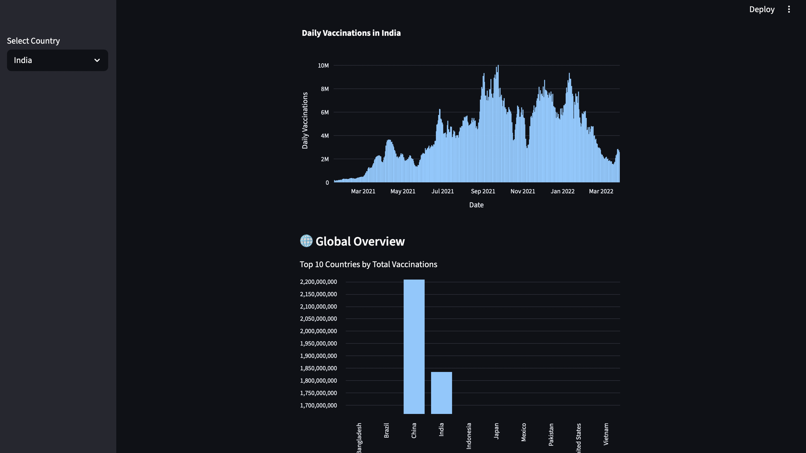

# COVID-19 Vaccination Dashboard

📊 A data analytics project that explores global COVID-19 vaccination trends using Python (Pandas, NumPy, Matplotlib, Seaborn) and an interactive dashboard built with Streamlit.

---

## 🚀 Features

- Data cleaning and preprocessing using Pandas & NumPy
- Exploratory Data Analysis (EDA) with visualizations
- Comparative analysis of vaccination progress across countries
- Interactive dashboard for real-time exploration

---

## 📂 Dataset

- Source: [Kaggle - COVID World Vaccination Progress](https://www.kaggle.com/datasets/gpreda/covid-world-vaccination-progress)
- Files Used:
  - `country_vaccinations.csv`
  - `country_vaccinations_by_manufacturer.csv`

---

## 🛠️ Tech Stack

- **Python**: Pandas, NumPy, Matplotlib, Seaborn
- **Dashboard**: Streamlit
- **Version Control**: Git & GitHub

---

## 📸 Sample Dashboard (Preview)




---

## ⚡ How to Run

1. Clone this repo:
   ```bash
   git clone https://github.com/hemayasekar/Covid-Vaccination-dashboard.git
   cd Covid-Vaccination-dashboard


2. Install dependencies:
    pip install -r requirements.txt


3. Run the dashboard:
    streamlit run covid_dashboard.py

## 🌐 Deployment
Deployed on **Streamlit Cloud** → [Live Demo](https://covid-vaccination-dashboard.streamlit.app)

